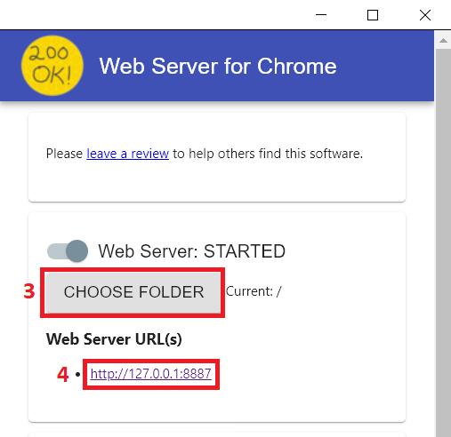

# Friends: The One with the InfoVis: VI 2021/2022

**Group 41** 

| Name | ISTID |
| :-: | :-: |
|Daniela Mendes|87646|
|Vasco Pires|87708|
|Catarina Rodrigues|87817|

Our project works on Google Chrome.

## How to run, *version 1*
### Requirements
* *Web Server for Chrome* Extension
1. Install Web Server for Chrome, available at https://chrome.google.com/webstore/detail/web-server-for-chrome/ofhbbkphhbklhfoeikjpcbhemlocgigb
2. Run/execute the extension:
3. Click on the button **CHOOSE FOLDER**, and choose the directory where *index.html* is located (root directory)
4. After choosing the folder, click on the web server URL displayed below the button

## How to run, *version 2*
### Requirements
* Visual Studio Code
* Live Server Extension
1. Download the zip version from the master and unzip it.
2. Install Visual Studio Code, https://code.visualstudio.com/.
3. Install Live Server *v5.6.1* in VS, https://marketplace.visualstudio.com/items?itemName=ritwickdey.LiveServer.
4. A button on the right bottom corner should appear as **Go Live**.
5. On the root directory, click on the button that says *Go Live*.
